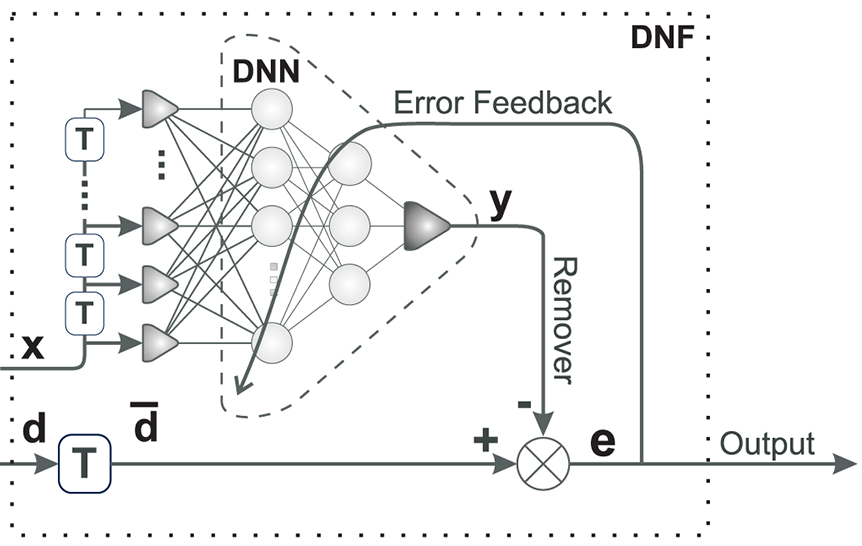

# Deep Neuronal Filter (DNF) -- libtorch version

A realtime noise reduction filter using deep networks in autoencoder configuration.



https://journals.plos.org/plosone/article?id=10.1371/journal.pone.0277974

## Prerequisites Libraries and packages

1) Make sure you have `cmake` and a c++ compiler installed.

2) Libtorch

 - Intel architectures: Get libtorch from the [PyTorch homepage](https://pytorch.org/get-started/locally/). Add `CMAKE_PREFIX_PATH=/path/to/libtorch` pointing to the libtorch directory as an environment variable.
 - ARM Debian (Raspberry PI): just do `apt install libtorch-dev` and you are all set!

## How to compile

Type:

```
cmake .
```
to create the makefile and then

```
make
```
to compile the library and the demos.

## Installation

```
sudo make install
```

## Documentation

[Doxygen generated documentation](https://berndporr.github.io/dnf_torch/)

## Example

[Simple instructional example which removes 50Hz from an ECG](ecg_filt_demo).


## Credits

 - Bernd Porr
 - Sama Daryanavard
