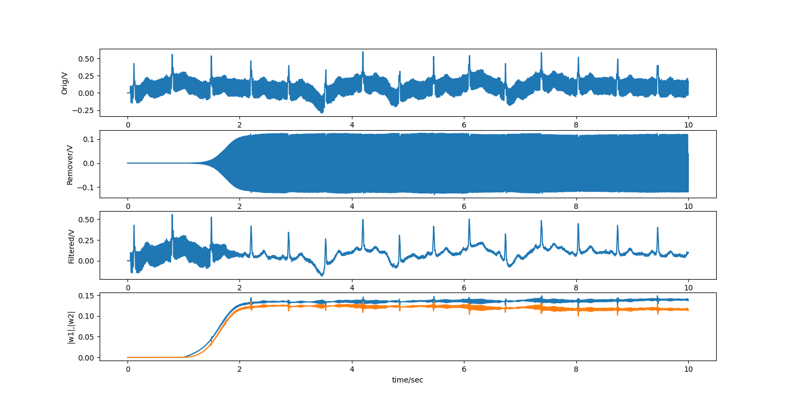

# 50Hz filter

Demo which filters out 50Hz mains from a noisy ECG.
This is a minimal example where the reference noise is just
a 50Hz sine wave and the DNF removes the 50Hz from the
ECG by using this 50Hz sine wave. This, of course, can also be
done by a simple LMS FIR filter but it serves here as an example
which can then be used for more complex reference signals.

## How to run

```
./ecg_filt_demo
```

or if you want to use CUDA: `./ecg_filt_demo 1`.

## How to plot the results?

```
python plot_results.py
```

which plots the contents of `ecg_filtered.dat`.


